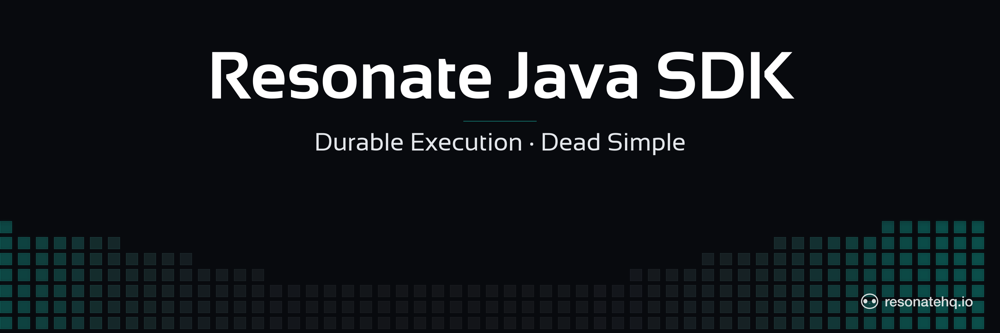

<p align="center">
  <picture>
    <source media="(prefers-color-scheme: dark)" srcset="./assets/banner-dark.png">
    <source media="(prefers-color-scheme: light)" srcset="./assets/banner-light.png">
    
  </picture>
</p>

[](https://github.com/resonatehq/resonate-sdk-java/actions/workflows/ci.yml)
[](https://opensource.org/licenses/Apache-2.0)

# Resonate Java SDK

> ⚠️ **Pre-release.** The Java SDK is at `0.1.1` — the first version published to Maven Central — and APIs may change before the surface settles. Check the [open issues](https://github.com/resonatehq/resonate-sdk-java/issues) for known gaps. The internal protocol is stable; the Java API surface is still settling.

## About this component

The Resonate Java SDK lets you build reliable, distributed Java applications on the durable execution programming model. Write ordinary `static` methods, register them with `Resonate`, and it handles retries, recovery, and replay — when a process crashes mid-workflow, execution resumes from the last checkpoint instead of starting over. The SDK requires **Java 21 or newer**: it drives durable executions on [virtual threads](https://openjdk.org/jeps/444), a feature generally available as of Java 21, so Java 8, 11, and 17 are not supported.

- [Open an issue or pull request](https://github.com/resonatehq/resonate-sdk-java/issues) — contribution starts here while the SDK is prerelease
- [Evaluate Resonate for your next project](https://docs.resonatehq.io/evaluate/)
- [Example application library](https://github.com/resonatehq-examples) — including the `-java` starter set
- [Distributed Async Await — the concepts that power Resonate](https://www.distributed-async-await.io/)
- [Join the Discord](https://resonatehq.io/discord)
- [Subscribe to the Journal](https://journal.resonatehq.io)
- [Follow on X](https://x.com/resonatehqio)
- [Follow on LinkedIn](https://www.linkedin.com/company/resonatehqio)
- [Subscribe on YouTube](https://www.youtube.com/@resonatehqio)

## Quickstart

1. Install the Resonate Server & CLI

```shell
brew install resonatehq/tap/resonate
```

2. Add the SDK to your build

The SDK is published to Maven Central as `io.resonatehq:resonate-sdk-java` and requires **Java 21+**. These files go in a Gradle project — starting from scratch, `gradle init` scaffolds the layout, the `settings.gradle.kts`, and the `./gradlew` wrapper that step 5 uses. With Gradle (Kotlin DSL):

```kotlin
// build.gradle.kts
plugins {
    application
}

repositories {
    mavenCentral()
}

dependencies {
    implementation("io.resonatehq:resonate-sdk-java:0.1.1")
}

java {
    toolchain {
        languageVersion = JavaLanguageVersion.of(21)
    }
}

application {
    mainClass = "myapp.Main"
}
```

Using Maven instead? The coordinates are the same:

```xml
<dependency>
    <groupId>io.resonatehq</groupId>
    <artifactId>resonate-sdk-java</artifactId>
    <version>0.1.1</version>
</dependency>
```

Jackson (`com.fasterxml.jackson.core:jackson-databind`) comes in transitively for the JSON durability boundary — nothing extra to declare.

3. Write your first Resonate function

Create `src/main/java/myapp/Main.java`. `greet` runs as a durable workflow: it calls a leaf function through `ctx.run`, and `Resonate` records that call as a durable child so a crash resumes from the checkpoint rather than re-running from the top.

```java
// src/main/java/myapp/Main.java
package myapp;

import io.resonatehq.resonate.Context;
import io.resonatehq.resonate.Handle.ResonateHandle;
import io.resonatehq.resonate.Resonate;

public final class Main {
    // A leaf function: pure computation, no durable op.
    public static String formatGreeting(Context ctx, String name) {
        return "hello, " + name + "!";
    }

    // A workflow: Resonate records the formatGreeting call as a durable child,
    // so a crash mid-run resumes from the checkpoint instead of starting over.
    public static String greet(Context ctx, String name) {
        return ctx.run(Main::formatGreeting, name).await();
    }

    public static void main(String[] args) {
        Resonate r = Resonate.builder().url("http://localhost:8001").build();
        r.register(Main::greet);
        try {
            String id = "greet-" + System.nanoTime();
            ResonateHandle<String> handle = r.run(id, Main::greet, "world");
            System.out.println(id + " -> " + handle.result());
        } finally {
            r.stop();
        }
    }
}
```

The SDK ships runnable example programs — hello-world, pipeline, saga, human-in-the-loop, retries, and more — under [`src/examples`](https://github.com/resonatehq/resonate-sdk-java/tree/main/src/examples).

4. Start the server (leave it running in its own terminal)

```shell
resonate dev
```

5. Run the program

```shell
./gradlew run
```

This one process does two jobs: `register` makes it a worker that can execute `greet`, and `r.run(...)` invokes the workflow and awaits the result.

**Result**

You'll see the durable promise ID and the greeting once the workflow settles:

```text
greet-1784461234567890 -> hello, world!
```

**What to try**

- Inspect the durable promise the workflow created with `resonate promises get <id>` (the ID is the `greet-...` value printed in step 5).
- Visualize the call graph with `resonate tree <id>` — you'll see the `greet` workflow and its `formatGreeting` child.
- Replace `"greet-" + System.nanoTime()` with a fixed ID and run twice. The second run returns the recorded result instead of re-executing the workflow — durability is keyed by the promise ID.

## Documentation

[Read the docs](https://docs.resonatehq.io) for the full programming model, the Context API, retry policies, and deployment patterns. A Java-specific skill guide (`develop/java`) is landing on the docs site; until it goes live, the [`src/examples`](https://github.com/resonatehq/resonate-sdk-java/tree/main/src/examples) programs in this repo and the [Python SDK](https://github.com/resonatehq/resonate-sdk-py) — whose API the Java SDK mirrors — are the closest reference.

## License

Apache-2.0 — see [LICENSE](./LICENSE).
